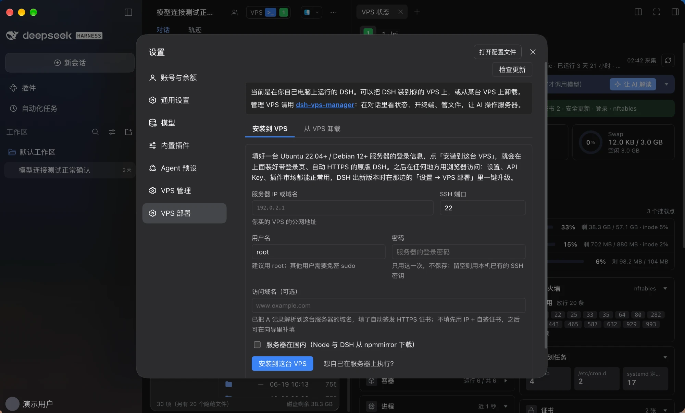
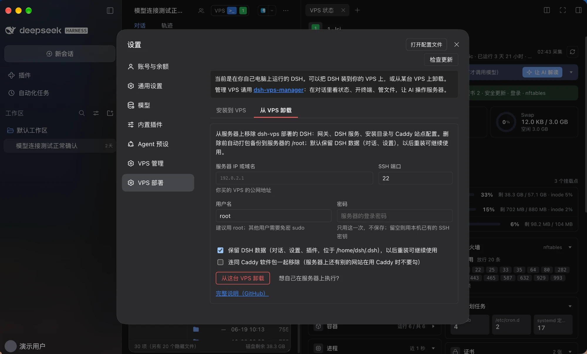
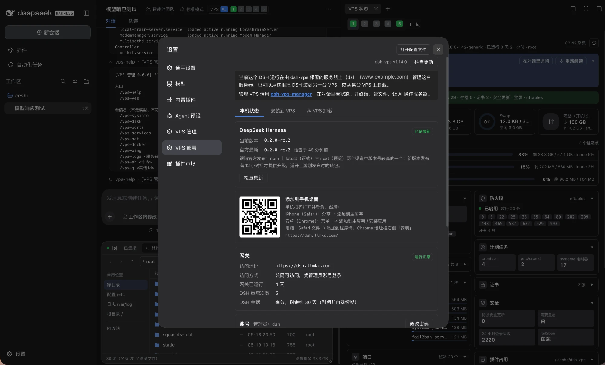

<div align="center">


# dsh-vps

<p><strong>Your DeepSeek Harness on your own VPS — one command, reachable from anywhere, native UI intact</strong></p>

<p>
  <a href="LICENSE"></a>
  <a href="https://www.npmjs.com/package/dsh-vps"></a>
  
  
  
  
  
  <a href="https://awesome-dsh-plugin.com/p/AIcivilization/dsh-vps/"></a>
  <a href="https://dshget.com/plugins/AIcivilization/dsh-vps"></a>
</p>

<p><a href="README.md">简体中文</a> · <strong>English</strong></p>

</div>

---

> **A VPS deployment tool for DSH: it puts stock DSH, behind a login page, on your own VPS so you can use it from any browser.** Pick either way to install:

**① From a form in the DSH on your own computer**: install the `dsh-vps` plugin from the plugin market (or run `dsh plugin add dsh-vps`), open **Settings → VPS Deploy**, enter the server IP, SSH port, username and password (plus a domain if you have one), and click "Install on this VPS".

**② With one command on the VPS**:

```bash
curl -fsSL https://raw.githubusercontent.com/AIcivilization/dsh-vps/main/install.sh | sudo bash -s
```

With a domain, or behind the GFW, append arguments at the end, e.g. `bash -s -- --domain dsh.example.com --mirror cn`. See [Install](#install) below.

---

## Overview

[DeepSeek Harness](https://github.com/deepseek-ai/deepseek-harness) (DSH) trusts the operator's own browser only: its privileged interfaces — settings, API keys, plugin management — sit behind a browser-trust fence, and a plain reverse proxy to the public internet leaves those pages dead.

dsh-vps puts a zero-dependency login gateway (dsh-gate) in front of DSH: public requests pass a scrypt login gate first, then the gateway performs DSH session authentication server-side and proxies the rest. You open a browser anywhere and get the stock DSH web interface — settings, models, API keys and the plugin marketplace all working.

---

## Capabilities

| Capability | Notes |
| --- | --- |
| Two ways to install | fill in a form and click install from the DSH on your own computer (Mac / Windows / Linux), or run one `curl \| bash` on the VPS; then it runs as a systemd service, started on boot |
| Login gate | scrypt password + HMAC session cookie + rate limiting; "Keep me signed in" (on by default) lasts 30 days; change the password under Settings → VPS Deploy → This server (needs the current one; every other device is signed out) |
| Add to your phone's home screen | scan the QR code under Settings → VPS Deploy → This server and add DSH to your home screen; it opens full-screen like a native app |
| Browser setup wizard | admin account, domain, DeepSeek API key and bundled plugins — all filled in from the browser |
| Chinese and English | the sign-in page, setup wizard and startup page follow the browser language, with a switch in the top-right corner that is remembered; the VPS Deploy page and upgrade prompt inside DSH follow the DSH language setting |
| One-time setup token | the wizard only answers to holders of the token; the link is printed at install time, re-printable, and voided once setup completes |
| One-click bundled plugins | 3 shipped in the wizard: this project's settings page dsh-vps (required), plus the plugin market and VPS manager (pre-checked, optional); installed in the background and activated by an automatic restart |
| Automatic HTTPS | Caddy issues and renews certificates; changing the domain in the wizard hot-reloads instantly |
| Native settings on a public domain | settings, models, API keys and permission policies read and write normally |
| Working plugin marketplace | browse and install plugins from the marketplace, and "restart now" just works |
| Self-healing startup | the first boot and plugin installs take tens of seconds; the page waits and enters on its own |
| One-click upgrades that follow upstream | a prompt appears when DSH releases a new version; upgrade with one click under Settings → VPS Deploy — backup → self-check → automatic rollback on failure, plus manual rollback at any time |
| Observable and recoverable | `/gate/health` on the server reports the crash reason and crash streak; `dsh-vps backup` keeps the latest 3 copies |
| Tightened exposure | session cookies are always Secure/HttpOnly/SameSite; diagnostics are reachable only from the server itself or an authenticated session; the service runs as the unprivileged `dsh` user under systemd sandboxing |

---

## Screenshots

<p align="center">
  
</p>

<details>
<summary><strong>Expand for all 12 screenshots</strong> (the VPS Deploy page in DSH → install → wizard → setup complete → login → DSH UI → settings → marketplace)</summary>

<br>

| Install on a VPS from a form in DSH | Uninstall from a VPS | "This server" on the VPS |
| :---: | :---: | :---: |
|  |  |  |

| Install done | Setup wizard | Wizard filled |
| :---: | :---: | :---: |
|  |  |  |

| Setup complete | Login gate | Logging in |
| :---: | :---: | :---: |
|  |  |  |

| Native DSH UI | Settings (works on a public domain) | Plugin marketplace |
| :---: | :---: | :---: |
|  |  |  |

</details>

---

## Requirements

- Ubuntu 22.04+ / Debian 12+ (root)
- 2 vCPU / 2 GB RAM or better; ports 80/443 open
- A domain gives you automatic HTTPS (point its A record at the server first); a public IP with a self-signed certificate works too

---

## Install

### Option 1: fill in a form in the DSH on your own computer

Works with DSH on Mac, Windows and Linux:

1. Add the `dsh-vps` plugin to DSH: search the plugin market, or run `dsh plugin add dsh-vps`
2. Open **Settings → VPS Deploy** and enter the server IP, SSH port, username and password; add a domain if its A record already points at the server, and tick "Server is in mainland China" if it is
3. Click "Install on this VPS"

- The password is used once and never stored; leave it empty to use your existing SSH key
- The page streams the install log and ends with the setup-wizard link
- The install runs in the background on the server, so closing the page or losing the connection does not stop it
- Needs an OpenSSH client on your computer: built into macOS and Linux; on Windows 10/11 add "OpenSSH Client" under Settings → System → Optional features

### Option 2: run one command on the VPS

```bash
curl -fsSL https://raw.githubusercontent.com/AIcivilization/dsh-vps/main/install.sh \
  | sudo bash -s -- --domain dsh.example.com
```

Add `--mirror cn` if you're behind the GFW (Node and DSH come from npmmirror).

No domain yet? Drop `--domain` and use the public IP:

```bash
curl -fsSL https://raw.githubusercontent.com/AIcivilization/dsh-vps/main/install.sh | sudo bash -s
```

The certificate then comes from Caddy's internal CA, so the browser warns "Not secure / certificate not trusted". That is expected — proceed anyway. Add a domain in the wizard later and Caddy switches to a real certificate. (The same applies to option 1 without a domain.)

Or install through npm, running exactly the scripts shipped in this package (pinned, no network fetch; needs Node 22+ on the machine):

```bash
npx dsh-vps-install install --domain dsh.example.com
```

To pin a release instead of `main`, replace `main` with the version tag and point later gateway fetches at the same tag:

```bash
curl -fsSL https://raw.githubusercontent.com/AIcivilization/dsh-vps/v1.7.0/install.sh \
  | sudo DSHVPS_RAW_BASE=https://raw.githubusercontent.com/AIcivilization/dsh-vps/v1.7.0 bash -s -- --domain dsh.example.com
```

If the final self-check reports that DSH is not ready yet, the setup link is still printed; the page shows startup progress and the actual error. Troubleshoot with `journalctl -u dsh-gate -n 80 --no-pager`.

## Update

**DSH itself follows official releases.** The gateway checks npm for the newest official version (the higher of the `latest` and `next` channels) every 6 hours. When a newer one exists, a prompt appears in the bottom-right corner of the DSH page (also available under Settings → VPS Deploy); click "Upgrade now" and confirm. It backs up, installs the new version and runs a self-check, rolling back to the previous version automatically if the check fails — about 1–3 minutes in all. "Later" silences that version. A release is offered only 12 hours after it is published — upstream sometimes publishes the main package hours before its sub-packages, and upgrading in that window just fails. From the server you can also run:

```bash
sudo dsh-vps upgrade            # the version verified by this project
sudo dsh-vps upgrade --latest   # the latest official release (same as "Upgrade now")
sudo dsh-vps rollback           # back to the previous version
```

**Updating the gateway itself** (login page, proxy):

```bash
sudo dsh-vps update-gate
```

Machines installed before v1.5.0: run the one-command install above once more to get the in-page upgrade prompt (it enters repair/update mode; accounts and data are kept).

## Uninstall

```bash
curl -fsSL https://raw.githubusercontent.com/AIcivilization/dsh-vps/main/uninstall.sh \
  | sudo bash -s -- --yes
```

**Uninstall from the DSH on your own computer**: Settings → VPS Deploy → "Uninstall from a VPS", enter the server login details, choose whether to keep DSH data and whether to remove Caddy too, and click "Uninstall from this VPS". DSH data is kept by default.

Or run the command above on the server. It removes the service, install directory, Caddy site block and the DSH data directory, packing a backup (Caddyfile included) to `/root/dsh-vps-uninstall-<timestamp>.tar.gz` first. The Caddyfile you had before installing is restored. `--keep-data` keeps the DSH data, `--purge-caddy` removes Caddy as well. Uninstall then install again gives you a clean environment.

---

## First run

Installation ends with a **setup link carrying a one-time token** (printed in the terminal for the command-line install, shown on the settings page for the form install) — open it to reach the wizard (opening the bare IP or domain only shows a "setup token required" page, by design): admin username/password → (optional) domain, DeepSeek API key & bundled plugins → log in. The wizard only answers to holders of the token, and the token is voided once setup completes. Lost the link? Print it again:

```bash
sudo dsh-vps setup-url
```

Skipping the API key is fine; you can add it later via the "Add API key" prompt or Settings → Models → DeepSeek.

The plugins install in the background (tens of seconds), always at their latest npm version, and DSH restarts to activate them. Three of them:

- **dsh-vps** (this project, required): the **Settings → VPS Deploy** page in DSH with three tabs — "This server" (DSH version with one-click upgrade, gateway status and access mode, common server commands), "Install on a VPS" and "Uninstall from a VPS" (install DSH on, or remove it from, another VPS over SSH). In the DSH on your own computer it shows only the last two. The page follows the language chosen in DSH under Settings → General → Language (DSH currently ships Chinese and English) and switches instantly; so does the in-page upgrade prompt

- **dsh-market**: browse, search and install community plugins and themes from Settings. Everything else is left to you — add whatever you want from the marketplace afterwards
- **dsh-vps-manager**: manage this very VPS from inside DSH — `/vps-` queries that skip the model and cost no tokens, a terminal in the conversation, AI operations confirmed by risk level, and a recipe library. Add this machine under Settings → VPS Manager (SSH key login)

---

## Management

```bash
sudo dsh-vps status        # service status + health + version hints
sudo dsh-vps restart       # restart (DSH restarts and re-exchanges its session)
sudo dsh-vps upgrade       # upgrade DSH to the latest verified version (backup → self-check → auto rollback)
sudo dsh-vps update-gate   # pull and restart the gateway code itself (no git repo on the VPS)
sudo dsh-vps ownshost on   # apply the settings-page patch (restores settings on a public domain)
sudo dsh-vps selfcheck     # run the regression self-check (login / RPC / WebSocket / session)
sudo dsh-vps rollback      # switch back to the previous DSH version
sudo dsh-vps reset-admin   # emergency reset if you lose the admin password (re-runs the wizard, new token, signs out every session)
sudo dsh-vps setup-url     # re-print the setup link with its one-time token
sudo dsh-vps backup        # back up data (keeps the latest 3)
```

The Caddy site block is generated by `gate/site-block.js` — installation and domain changes share that one template.

---

## How it runs

<p align="center">
  
</p>

Both DSH and the gateway bind to 127.0.0.1 only, the user's browser never sees DSH's session cookie, and every request is proxied through after the gateway authenticates it.

- **Self-healing startup**: during first boot and plugin installs the page shows "DeepSeek Harness 正在启动", polls health every 3s and reloads itself as soon as the session is ready.
- **Settings availability**: DSH's frontend decides "is this the operator's own browser" from the page hostname and hides settings on a public domain. The gateway serves the officially supported `__DSH_TRANSPORT__.ownsHost` declaration alongside the page, which restores settings, models, API keys and permission policies. `--trusted-host` only opens the network fence — the two are separate gates.
- **Marketplace restart**: "restart now" is handled by the gateway — it strips Caddy's `X-Forwarded-For` (which trips DSH's loopback check and 403s) and restarts the DSH child process it owns, keeping session exchange intact.
- **Troubleshooting entry points**: `sudo ss -ltnp | grep 3080` finds stale DSH processes; `curl -s http://127.0.0.1:3100/gate/health` on the server reports `lastError`, `lastExit` and `crashStreak` (that endpoint answers only to the server itself or an authenticated session).

---

## Repository layout

| File | Purpose |
| --- | --- |
| `install.sh` | one-command installer (optional `--domain`, `--mirror cn`) |
| `uninstall.sh` | uninstall with backup |
| `bin/dsh-vps` | operations CLI |
| `gate/server.js` | login gateway (Node, zero dependencies) |
| `gate/site-block.js` | Caddy site block template (shared by install and domain change) |
| `caddy/Caddyfile.template` | Caddy main config |
| `units/dsh-gate.service` | systemd unit template |
| `versions.json` | verified DSH version list |
| `plugin/` + `cordis.patch.yml` | the DSH plugin: Settings → VPS Deploy (version and one-click upgrade, gateway status; or install to a VPS over SSH from a form) |

---

## License

[MIT](LICENSE)
